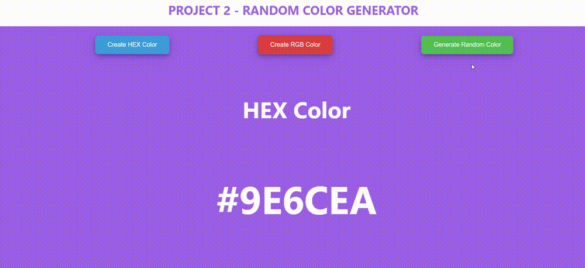
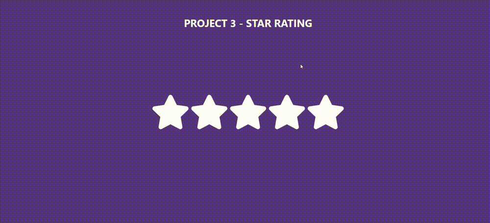

# PRACTICE PROJECTS

## PROJECT 1 - ACCORDION

### SUMMARY :

An accordion is a graphical user interface (GUI) element that allows users to expand or collapse sections of content on a webpage. It is a commonly used UI pattern for managing content and presenting it in a structured and organized manner. The accordion typically consists of a series of collapsible panels, each containing content or information.

### FEATURES :

- Made in Reactjs
- Single selection and Multi Selection features with all dynamics using a button

## PROJECT 2 - RANDOM COLOR GENERATOR

### SUMMARY :

The generator typically produces colors in various formats such as hexadecimal (e.g., #RRGGBB) and RGB (e.g., rgb(255, 0, 0)) It may generate completely random colors or colors within specified ranges or constraints.

### FEATURES :

- Made in Reactjs
- The core feature is the ability to generate random colors dynamically. This includes generating colors in two formats such as hexadecimal and RGB

## PROJECT 3 - STAR RATING

### SUMMARY :

A star rating system on a website allows users to express their opinions or feedback on products, services, or content by assigning a rating represented by stars.

### FEATURES :

- Made in Reactjs
- Users typically interact with the star rating system by clicking on a set of stars to indicate their rating. The number of stars usually ranges from 1 to 5, with 1 star representing the lowest rating and 5 stars representing the highest rating.

