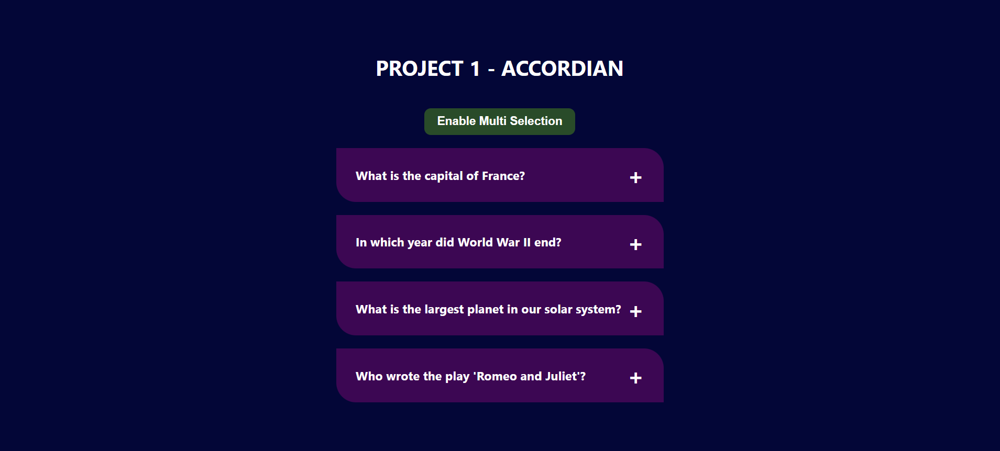

# PRACTICE PROJECTS

## PROJECT 1 - ACCORDIAN
### SUMMARY : 
An accordion is a graphical user interface (GUI) element that allows users to expand or collapse sections of content on a webpage. It is a commonly used UI pattern for managing content and presenting it in a structured and organized manner. The accordion typically consists of a series of collapsible panels, each containing content or information.

### FEATURES :
- Made in Reactjs
- Single selection and Multi Selection features with all dynamics using a button

